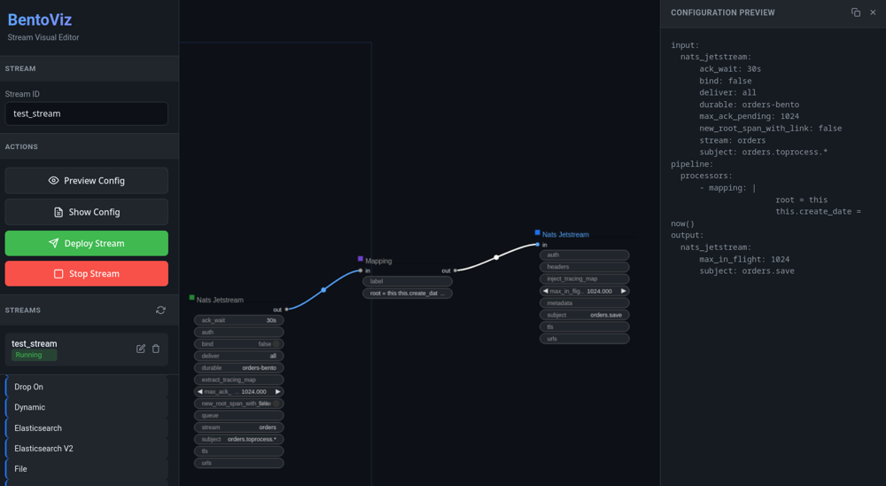

# BentoViz

Work in Progress, do not use unless for contributing.

A visual node editor for Bento stream processing workflows, built with LiteGraph.js.



## Overview

BentoViz provides a graphical interface for designing, configuring, and deploying Bento stream processing pipelines. It allows you to:

- Visually compose input → processor → output pipelines
- Auto-generate configuration from the Bento JSON schema
- Deploy streams directly to a running Bento instance
- Save and load workflow graphs
- Export configurations in YAML or JSON format

## Features

- **Visual Node Editor**: Drag-and-drop interface for building stream pipelines
- **Schema-Driven**: Automatically generates nodes from Bento's JSON schema (inputs, processors, outputs)
- **Live Deployment**: Deploy streams to Bento via REST API
- **YAML Export**: Generate clean YAML configurations
- **Auto-Save**: Graphs are automatically saved to browser storage
- **Stream Management**: List, deploy, and stop streams from the UI
- **Special Processor Support**: Visual editing for processors with nested processors (branch, retry, switch, group_by)

## Prerequisites

- [Go 1.21+](https://golang.org/dl/)
- A running [Bento](https://github.com/warpstreamlabs/bento) instance (for stream deployment)

## Building

```bash
go install github.com/akhenakh/bentoviz@latest
```
Or download a binary.

## Running
You need a running Bento: `bento streams`.

```bash
# Start BentoViz (default: port 8080, proxies to localhost:4195)
./bentoviz

# Custom port and Bento URL
./bentoviz -port 3000 -bento http://localhost:4195

# Show help
./bentoviz -h
```


## Usage

1. **Open the Editor**: Navigate to `http://localhost:8080` in your browser

2. **Add Nodes**: 
   - Double-click or drag nodes from the left palette into the canvas
   - Nodes are organized by category: Inputs, Processors, Outputs

3. **Connect Nodes**:
   - Drag from an output port to an input port to create connections
   - Pipeline flow: Input → Processor(s) → Output

4. **Configure Nodes**:
   - Click on a node to see its properties
   - Click on text fields to edit values
   - For multiline fields (mapping, bloblang), a popup dialog appears

5. **Deploy Stream**:
   - Enter a Stream ID in the sidebar
   - Click "Deploy Stream" to push to Bento
   - View active streams in the Streams list

6. **Export Configuration**:
   - Click "Preview Config" to see the generated YAML
   - Click the copy button to copy to clipboard

7. **Save/Load Graphs**:
   - "Save" button downloads the current graph as JSON
   - "Load" button imports a previously saved graph

## Special Processors

Some Bento processors have nested processor lists. BentoViz provides special handling for these:

### Branch Processor

The `branch` processor executes processors on a mapped copy of the message:

- Connect processors to the `processors` output (right side)
- Configure `request_map` and `result_map` fields

```yaml
- branch:
    request_map: 'root = {"id": this.id}'
    processors:
      - http:
          url: http://example.com/api
    result_map: 'root = this'
```

### Retry Processor

The `retry` processor retries failed messages:

- Connect processors to the `processors` output (right side)
- Configure `max_retries` and `parallel` options

```yaml
- retry:
    max_retries: 3
    parallel: false
    processors:
      - http:
          url: http://example.com/api
```

### Switch Processor

The `switch` processor routes messages to different processor chains based on conditions:

- Click **"+ Add Case"** button to add cases
- Each case has a `check` condition field
- Connect processors to each case's output (right side)

```yaml
- switch:
    - check: this.type == "foo"
      processors:
        - mapping: 'root.result = "foo"'
    - check: this.type == "bar"
      processors:
        - mapping: 'root.result = "bar"'
```

### Group By Processor

The `group_by` processor groups messages and processes each group:

- Click **"+ Add Group"** button to add groups
- Each group has a `check` condition field
- Connect processors to each group's output (right side)

```yaml
- group_by:
    - check: content().contains("foo")
      processors:
        - archive:
            format: tar
        - mapping: 'meta grouping = "foo"'
```

### Label Field

All processors have an optional `label` field for uniquely identifying them in observability data (metrics, logs):

```yaml
- label: my-processor
  mapping: |
    root = this
```

## Development

### Updating the Schema

1. Download the latest Bento schema:
   ```bash
   # From Bento's docs or source
   curl -o schema.json https://raw.githubusercontent.com/warpstreamlabs/bento/main/config/schema.json
   ```

2. Rebuild the binary:
   ```bash
   go build -o bentoviz .
   ```

### Special Processors in Code

Special processors (branch, retry, switch, group_by) are handled differently:

- **Branch/Retry**: Use `processorsAnchor` flag; have a `processors` output port
- **Switch/Group By**: Use `switchNode` flag; have dynamic case/group outputs with buttons

## API Endpoints

The Go server proxies the following endpoints to Bento:

| Endpoint | Method | Description |
|----------|--------|-------------|
| `/streams` | GET | List all streams |
| `/streams/{id}` | POST | Create/update stream |
| `/streams/{id}` | DELETE | Delete stream |

## License

MIT License - see LICENSE file for details.
